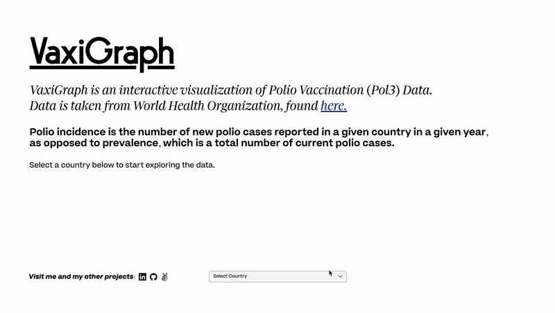

# VaxiGraph

<p width="700" align="center">
  
</p>

---

[Visit VaxiGraph](https://owenhaupt.io/VaxiGraph/)

VaxiGraph is an interactive visualization of international polio incidence vs. vaccination rate over time, by country.

---

## Technologies

- VaxiGraph is built using the data-vis library D3.js in addition to vanilla JavaScript.

---

## Features

- Users can select any country from which to display data
- Hovering the mouse over the graph will interpolate the data for the user to read
- Displays data from [World Health Organization](https://www.who.int/immunization/monitoring_surveillance/data/en/) (WHO)

---

### Country Selector

- Any country can be selected and the WHO's data will appear on the graph, following an `onchange` event.

<p width="350" align="center">
  
</p>

---

### Hovering Line Readout

<p width="450" align="center">
  
</p>

- Using D3, data values are interpolated based on position of mouse when the `mousemove` event fires above the graph.

```js
// setting the current position of mouse to variable
let container = document.getElementById("mouse-rect");
let mouseXY = mouse(container);

// using corresponding x-value to draw a new vertical path
select(".mouse-line").attr("d", () => {
  let d = "M" + mouseXY[0] + "," + innerHeight;
  d += " " + mouseXY[0] + "," + 0;
  return d;
}); 
```

- The data at the x-value is also displayed along the colored graph lines.

```js
// where [i] specifies the blue or orange line
if (lines[i].getAttribute("class") === "coverage-path") {
  select(this)
    .select(".moving-label")
    // adding text translation of dependent variable based on mouse position (pos)
    .text(`${y2Scale.invert(pos.y).toFixed(2)}%`);
}

// where i specifies the blue or orange line
if (lines[i].getAttribute("class") === "incidence-path") {
  select(this)
    .select(".moving-label")
    // adding text translation of dependent variable based on mouse position (pos)
    .text(y1Scale.invert(pos.y).toFixed(0));
}
```

---

### Data

- At [this link](https://www.who.int/immunization/monitoring_surveillance/data/en/), one can find separate CSVs for polio incidence (new cases per year) and vaccination rate (percentage of population which received Pol3 vaccine).
- These are parsed independently using `D3.csv` then combined into on object for every year's worth of data.

```js
function loadIncidence(countryIdx) {
  return new Promise(resolve => {
    csv("./data/polio_incidence.csv").then(data => {
      const dataArr = [];

      const columns = Object.keys(data[countryIdx]);
      const years = columns
        .map(colHeader => {
          if (+colHeader) return +colHeader;
        })
        .filter(header => typeof header === "number");

      // creating object (one for each year) which will eventually be interpreted by D3 functions
      years.forEach(y => {
        const obj = {};
        obj.year = y;
        // here, the first dependent variable is loaded into the each object
        obj.incidence = +data[countryIdx][y];
        dataArr.push(obj);
      });

      resolve(dataArr);
    });
  });
}

// (loadCoverage is chained to the Promise returned by the above loadIncidence)
function loadCoverage(countryIdx, dataArr) {
  return new Promise(resolve => {
    csv("./data/polio_coverage_estimates.csv").then(data => {
      dataArr.forEach(obj => {
        // here, the second dependent variable is added to each object
        obj.coverage = +data[countryIdx][obj.year];
      });

      // now, we send the entire array of objects to our D3 SVG-drawing functions
      resolve(dataArr);
    });
  });
}
```

---

## Future Plans

- In the future, I plan to parse more vaccine data for other diseases and add an option to toggle between them.
